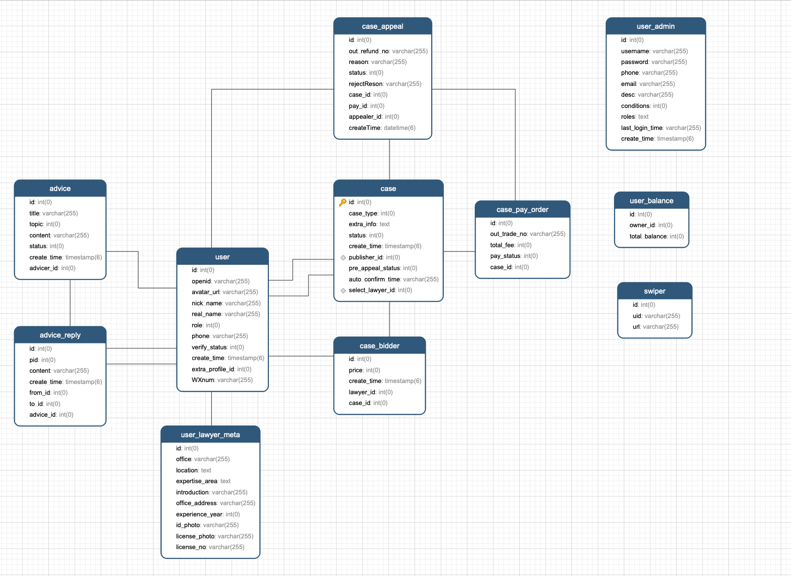

# 一个 NodeJs service 服务

## 前言

> 最近朋友喊我做一个关于法律平台的小程序，包括 front-end/back-end。最近空闲时间比较多，于是答应了下来，也借此机会尝试下进入新领域，毕竟老是写前端业务交互，难免有点腻了。

## 技术选型

既然要做 Node 服务，脑海中第一时间想到是 Koa 框架，原因是小而美，轻量，源码也比较通俗易懂，万一遇到什么坑的时候，也可以查阅源码解决。koa 的中间件模型，也很好地支持统一封装 request 错误处理。

其次， 在数据储存方面，选择 mysql 关系形数据库，引入 typeorm 提供函数式方法操作数据库，解决了作为一个小前端对数据库这个陌生领域的恐惧。

最后，对于语言的选择，虽然之前自己也有写过一年的 typescript 的项目，但那时候都是跟着当时的大佬写的，未能领会到正在 typescript 的魅力。typescript 在开发阶段，的确能避免一些低级错误，同时在类型推断方面也提高了不少效率。因此这次很羞耻选择了 typescript 作为编码语言（你看这个人写的 ts 怎么和 js 一摸一样？～～）

## 业务功能

[传送门](./feature.md)

### 数据库设计

在做这个项目，主要的时间花在如何整合数据，设计多张表的一对多/多对一，多对多关系等。因为是第一次接触后端项目，在这次 mysq 表设计方面肯定存在不合理的地方。但到写到这个阶段还是挺有意思的，把东西从 0 到 1 一步一步实现了，并且在实现的过程中迫使自己去了解学习更多的东西，所以还是挺有意思的嘛。

在做这个项目，主要的时间花在如何整合数据，设计多张表的一对多/多对一，多对多关系等。因为是第一次接触后端项目，在这次 mysq 表设计方面肯定存在不合理的地方。但到写到这个阶段还是挺有意思的，把东西从 0 到 1 一步一步实现了，并且在实现的过程中迫使自己去了解学习更多的东西，所以还是挺有意思的嘛。

### 部署

travis + pm2, travis 加密 id_rsa 通过 ssh 连接服务主机，master 分支代码有更新的时候，自动跑构建服务到远程主机，最终触发了`pm2 reload ecosystem.config.js`更新。舒服～

## 总结

在开发到后期的时候，发现了很多问题，由于是第一次用 node 写服务，很多东西都是摸石头过河，感觉在 mysql 建表，路由管理方面等比较混乱，导致越写越不爽。在技术选型方面，到后期才发现 nestjs 这个框架，大概了解和学习了一下，依赖注入，AOP 思想，PF 编程方式用起来简直不要太爽，第一感觉就是我想要的技术型了，强迫症的我，甚至想要重构整个项目的冲动，考虑到时间因素以及对前端的影响，简单重构了一个基于 nestjs 的项目，优化了很多现有不合理的地方，并且引入了 docker 容器打包部署，传送门：https://github.com/yiyu-liao/hello-nest, 就酱紫～ 溜了溜了
